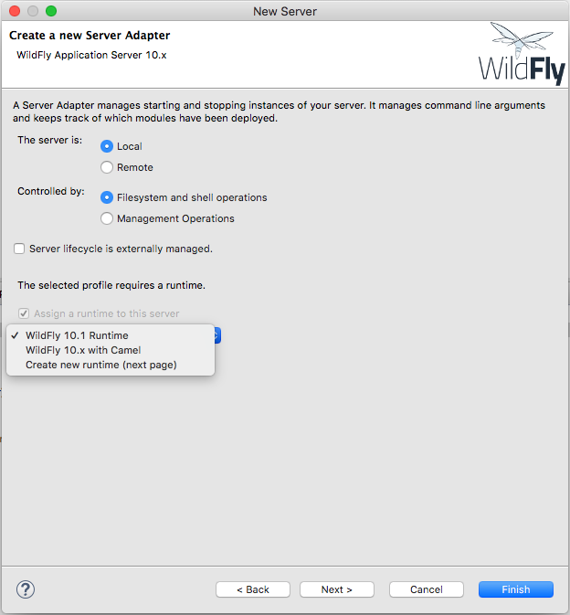
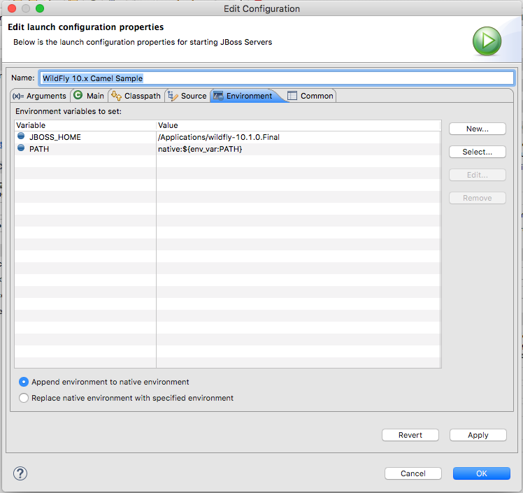

# Configure ‘Wildfly with Camel’ to use SSL and AUTH

## Setup & Configuration

The following software needs to be setup to get this sample going. Please follow the links and setup the software

1. Windfly - 10.1.0.FINAL : http://wildfly.org/downloads/
2. Red Hat JBoss Developer studio (JBDS) 11.3.0.GA, more info at http://www.jboss.com/products/devstudio

For some reason the documentation around this is a bit patchy and hence would like you to rely on the raw docs at github found at https://github.com/wildfly/quickstart/tree/10.x/guide

Specifically refer to https://github.com/wildfly/quickstart/blob/10.x/guide/GettingStarted.asciidoc for setting up the softwares. When creating the servers ensure that you select Wildfly server 10.x. 

Additionally we need Wildfly-Camel patch for Camel integration into Wildfly.

- Wildly-Camel patch 4.9.0 : https://github.com/wildfly-extras/wildfly-camel/releases

To setup and configure the Wildfly-camel patch please follow the documentation at https://wildfly-extras.github.io/wildfly-camel/, specifically the section ‘Standalone Server’ as we will be using the same. Note: when you unpack the archive, ensure that you unpack the archive into the root folder of Wildfly Home directory and ensure that you merge the files and not replace the existing folders with the ones from the archive.

Once the Wildly-Camel patch is started in standalone mode as in documentation, it is time to setup another server with the Wildly-Camel configuration within JBDS. Follow the same process to create a server. But select the “Wildfly with Camel” configuration in the respective window in the process wizard flow, see screenshot below.


This will create a Wildfly server with Camel integrated. We will be deploying i3bo-camel web app project to this server. Ensure that the http end-point is available at http://localhost:8080 and http-ssl end point in available at  https://localhost:8443; with the https end-point the browser will warn you that website is not secure, this is due to the fact that the certificate is a self-signed one. Ignore the same and proceed to the site. The same WildFly home page received at http end-point should be available here also.

# Importing the web app and deploying it to Wildfly

As the webapp is based on maven, the same can be imported into the IDE using the import maven option. Do a maven update to ensure that all maven libraries are downloaded and the web app is built without errors.

In the webapp there are 2 camel context files. The files have references to properties file environment.properties. Ensure that the file is available in the respective path. If you are starting the server from within the JBDS then ensure that the JBOSS_HOME is set to the right path in the launch configuration (see image). If you are starting the server from CLI using the batch/shell scripts then the JBOSS_HOME should be determined automatically by the script.

The following are the configurations to be checked

1. environment.properties file should be copied to '/standalone/configuration' directory within the WildFly install directory
2. In the 'example-basic-auth-consumer-camel-context' ensure that the 'config' property has the absolute value to the 'basicAuthRealm.properties' file which has the authentication information. For some reason the variable defined in the properties bean is not being picked up in the 'fileLoginService' bean, should be something to do with the order of loading and DI of the beans. Need to do some research on this, but for the time being putting the location in the file works.

Once this process is done, deploy the i3bo-camel web-app into the WildFly server by using the 'Run As > Run on Server' option in the context menu. Once the server is started please visit the following two URLs. Follow the instructions further to check the proper functioning of the application

1. https://0.0.0.0:25002/camel-sample-rest/rest/say/hello

The site should present a certificate warning. You can use the proceed option to go further to see a response which says "Hello REST World"

2. https://0.0.0.0:25002/camel-sample-rest/rest/say/secure/hello

The site to should present a login window where you can enter the username and password which has ROLE_USER role. The authentication should succeed and you should see the string "Hello SECURE REST World".

Now we can proceed to verify whether a Java client can connect to these REST end-points.

This is done in the camel-rest-client project in the root of this GitHUb repo. Please import the project into JBDS and run the same using command 'mvn clean package'. There are 2 tests that should run and execute successfully; the build should succeed. Go through the comments to see that there are 2 log outputs which show that the SSL call and the SSL with AUTH call has succeeded.
    
### Note: Generation of self-signed certificates

Generation of self-signed certificates has to be done and they need to available to the applications from their respective directories from an access point of view. Please refer to the following [link](https://github.com/wildfly/quickstart/tree/10.x/helloworld-war-ssl) for generating the self-signed certificates and related files. My experience is that it is easier to user the java Keytool rather than OpenSSL, but it is ones own preference I would say. Please ensure that the password to the various certificates and keystores are noted down so that they can be used in the config files when required. 

The certificate related files referred in this sample are as follows. The references are also specified in the environment.properties and the camel-context files.

1. application.keystore: shall be generated by the WildFly server automatically on reference to a SSL connection. See the Wildfly startup log for the creation of the same. You should see this file in the WILDFLY_HOME/standalone/configuration folder. 
2. client.truststore: is created as part of the certificate generation using java 'keytool' utility. This is the trust store against which the incoming client certificate will be validated and trusted by the server. 
3. clientCert.p12: The certificate that is sent by the client to the server at the mutual cert verification.
